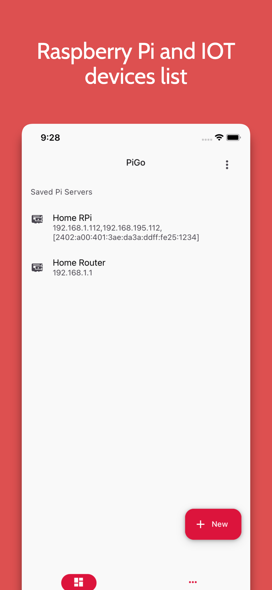
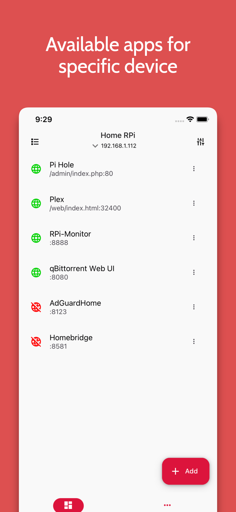
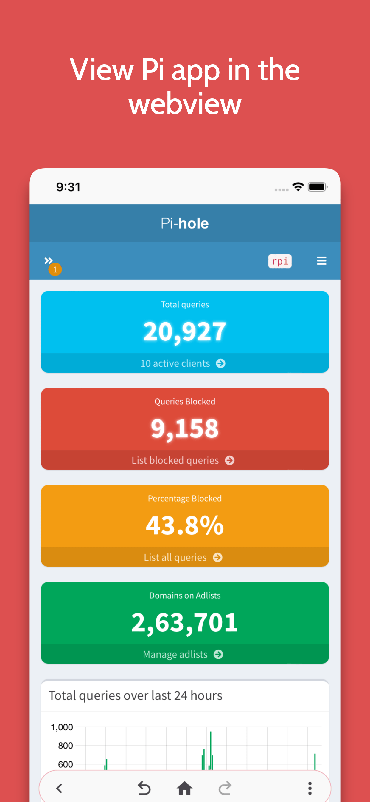
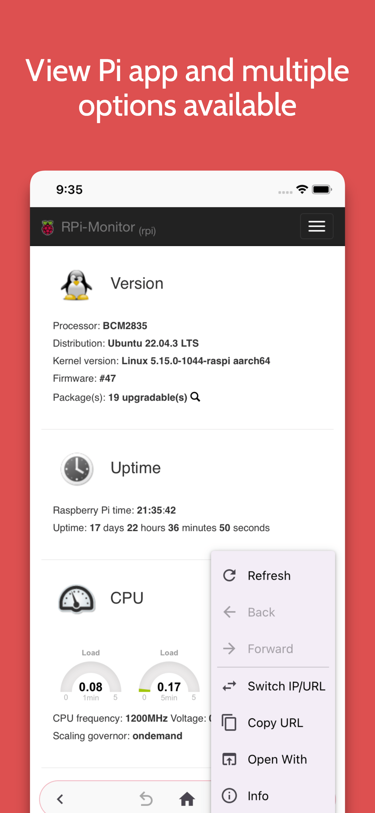
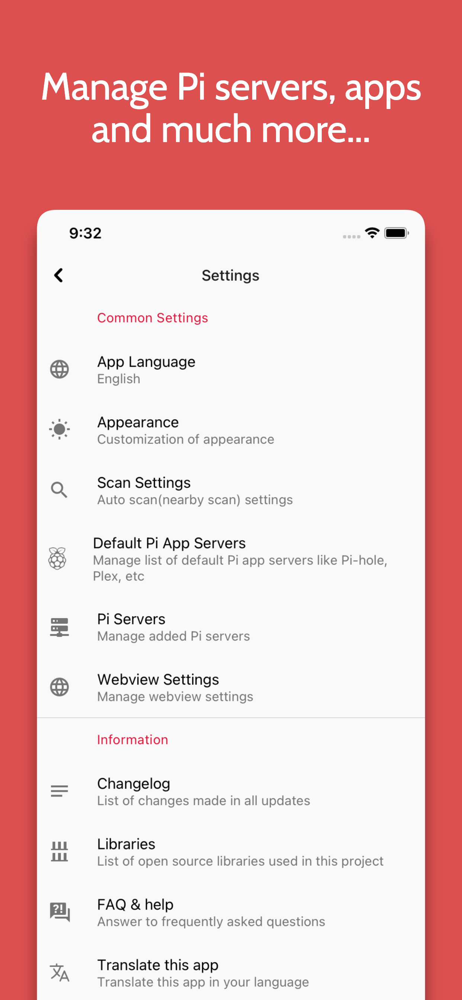
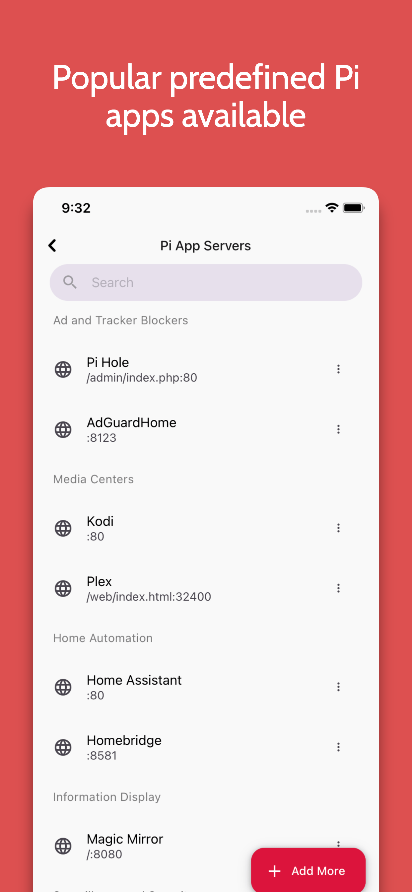
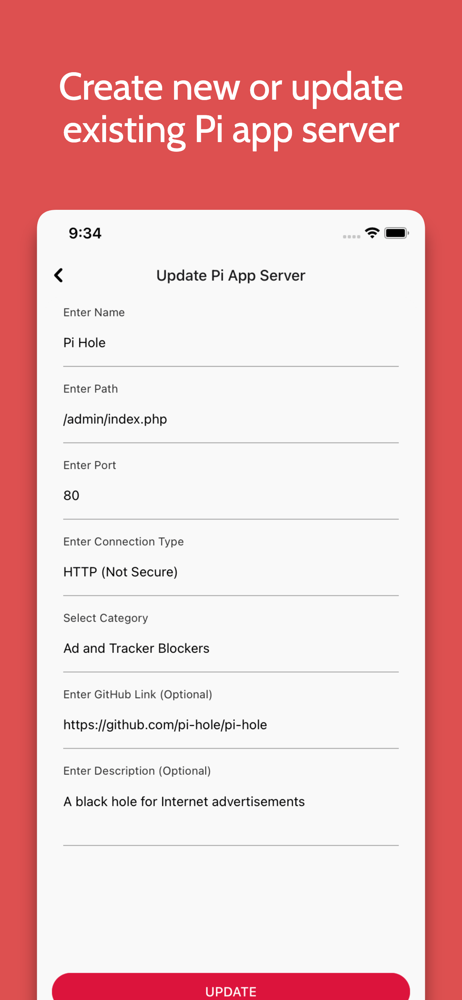
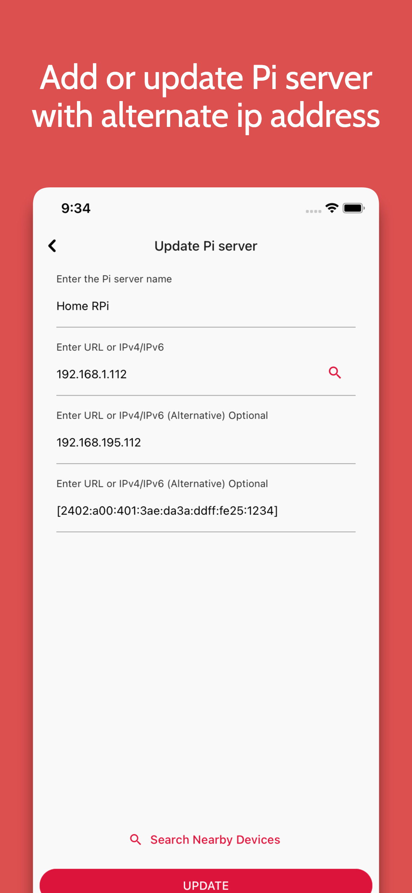

# Introduction

Welcome to PiGo – the open-source, free mobile companion for Raspberry Pi enthusiasts. Effortlessly explore and manage multiple Pi servers on the go.

PiGo: Your free and open gateway to seamless server navigation.

## Installation

Get the app from Google Play:

### Screenshots

|                                                |                                                    |                                          |                                          |
| :--------------------------------------------: | :------------------------------------------------: | :--------------------------------------: | :--------------------------------------: |
|  |  |  |  |
|  |  |  |  |

The application supports Android 5.0 (API 21) and above.

## Features include:

Home Page Features:
- List of Pi Servers: Display all Pi servers on the home page.

Pi Server Management:
- Add, Update, Delete: Allow users to manage Pi servers by adding, updating, and deleting them as needed.
- Auto Scan: Provide the option to automatically discover Pi app servers locally.
- Add Pi Server: Enable users to add multiple Pi servers with support for both IPv4 and IPv6 addresses/URLs.

Pi Apps Management:
- Predefined Pi Apps: Allow users to add predefined Pi apps to their Pi servers.
- View Pi Apps: Access Pi apps in the webview with features like refresh, forward, backward, and URL switching support.
- Default Pi App Server: Manage the default Pi app server with options to add, update, and delete servers.

Additional Settings:
- Auto Scan Settings: Configure settings for auto-scanning Pi app servers.
- Webview Settings: Adjust settings such as user-agent, JavaScript enable/disable, and clear website data.

User Experience:
- Dark Theme Support: Offer a dark theme for improved visibility and reduced eye strain.
- Multi-Language Support: Provide language options for users to navigate the app in their preferred language.
- Tablet/iPad and Phone support.

## Building
>  Note: You can't Publish any Source code without permission.

### Basic setup

If you want to build from source, just do

    git clone https://github.com/gajjartejas/PiGo.git
    cd PiGo
    `npm install` or `yarn`
    cd ios && pod install && cd..

### With Android Studio

1. Clone repo `git clone https://github.com/gajjartejas/PiGo.git`
2. In Android Studio select "Open an existing Android Studio Project"
3. Wait for Gradel to sync and then run or build.

### With Xcode

1. Clone repo `git clone https://github.com/gajjartejas/PiGo.git`
2. Navigate to `PiGo/ios` and open `PiGo.xcworkspace` folder.
3. Run the project.

## Todo

1. Auto refresh webview.
2. Print support and save as PDF support.
3. Push notification support.
4. Background notification support.

## Contributing

There are many ways you can contribute to the development.

- Pull requests are always welcome!
- You must respect conventional commits for your commits and MR title.
- You can merge only if your CI is green.
- give priority to squash and merge, and not merge with a merge commit
- Please visit [CrowdIn](https://crowdin.com/project/pigo) to update and create new translations

## License

PiGo is licensed under the [MIT License](https://github.com/gajjartejas/PiGo/blob/main/LICENSE).
